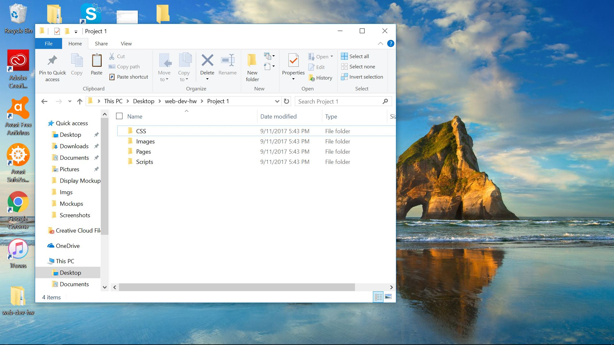

# My First README.md
## Grace Krakow
---
**Summary**

*This Homework Cycle*

* I learned Markdown
* I learned how to manage my files
* I learned the difference between a text document and a word processor



```markdown
Gosh this is fun, but confusing. 
```

**Problems or Issues**

I had trouble navigating all of the differnt pages at first, but was able to follow along with the walkthrough videos.

**Things to Discuss Further**

1. Navigating Atom
2. More types of customization

---

I did not post my problems to issue to the repo.

---

I found this site particularly helpful for learning more about code-
[CodeAcademy](https://www.codecademy.com/)
